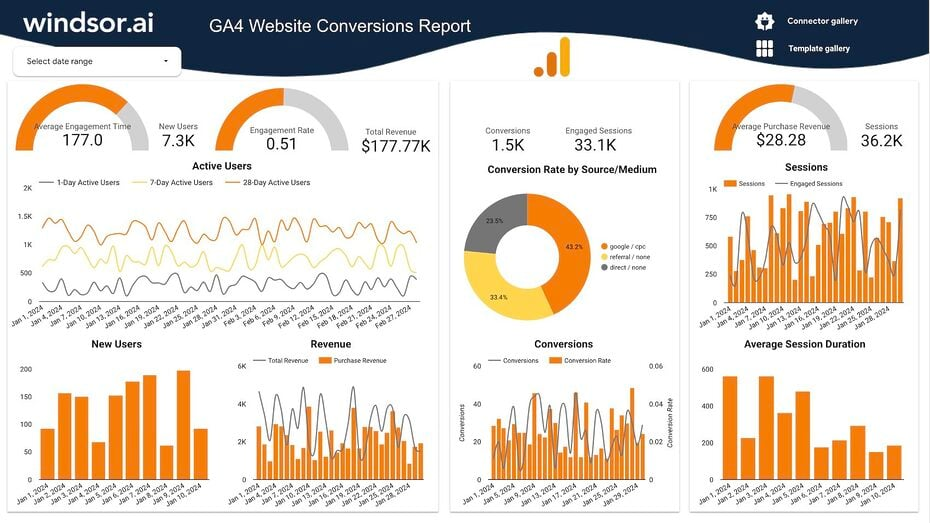

# Looker-Studio-Projects
Looker Studio Freelance Projects

# Project Reports and Assets

This repository contains reports, visuals, and media related to analytics and marketing data.

---

## 📊 Reports

| Report Name | Description | View / Download |
|--------------|--------------|------------------|
| **Litinac Report** | Marketing performance overview | [📄 View PDF](./Litinac_Report.pdf) |
| **Memora Report** | Campaign analytics summary | [📄 View PDF](./Memora_Report.pdf) |
| **Memora Report (1)** | Additional version of Memora report | [📄 View PDF](./Memora_Report%20(1).pdf) |
| **Scan Dashboard Report** | Dashboard insights | [📄 View PDF](./Scan_Dashboard.pdf) |

---

## 📈 Visuals

| Image | Description |
|--------|-------------|
|  | Overview of call leads data |
|  | Google Analytics 4 conversions summary |
|  | Meta ads analytics visualization |
|  | Meta ad campaign breakdown |

---

## 📜 License

This project is licensed under the terms of the [LICENSE](./LICENSE) file.

---

## 🧾 Additional Info

Refer to this README for quick navigation of project files and analytics resources.

